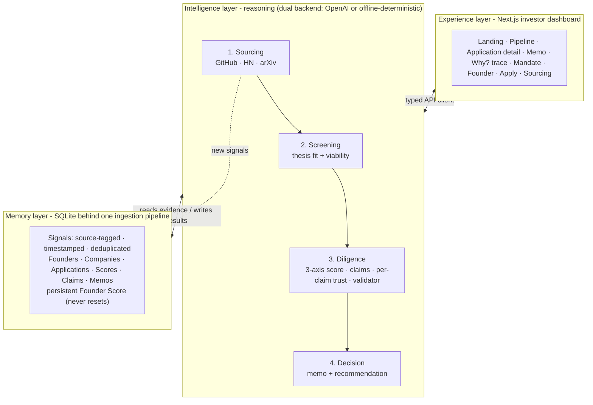

# The VC Brain

An AI-first VC operating system that runs the top of the venture funnel end to end: **sourcing -> screening -> diligence -> decision**. It ingests heterogeneous founder and company signals (pitch decks, GitHub, launches, social, analyst notes) into a deduplicated, source-tagged, timestamped memory layer with a persistent Founder Score, scores each company on three independent axes (Founder, Market, Idea-vs-Market) through a configurable thesis, runs per-claim trust checks that surface contradictions and flag missing data, and produces an investment memo with a recommendation. Every reasoning step is traceable: click "Why?" on any score or claim and see the exact signals -> rationale -> validator outcome -> memo line that produced it.

It runs **fully offline** via a deterministic reasoning backend (used for the demo). Add a funded `OPENAI_API_KEY` to upgrade reasoning to live GPT with no code change.

## Architecture

Three layers - **Memory** (what we know), **Intelligence** (how we reason), **Experience** (how an investor sees it) - wrapped around a four-stage pipeline.



- **Memory** (`backend/`, SQLAlchemy + SQLite) - every signal, regardless of source, enters through one ingestion pipeline that normalizes -> deduplicates -> resolves entities (founder/company) -> persists with both event time and ingestion time.
- **Intelligence** (`backend/app/reasoning/`, `backend/app/sourcing/`) - screening, 3-axis scoring, cold-start path, diligence, trust checks, validator, memo, and NL query. Each step sits behind a dual backend seam (see [Design decisions](#design-decisions)).
- **Experience** (`frontend/`, Next.js 16 App Router + Tailwind v4 + shadcn/ui) - a thin typed API client (`lib/api.ts`) with explicit loading/error states on every view.

## Prerequisites

- Python 3.12+ and [uv](https://docs.astral.sh/uv/)
- Node.js 18+ and npm

## Quickstart

```bash
# 1. Backend deps + rebuild the canonical demo DB from scratch (offline, deterministic)
cd backend
uv sync
uv run python -m app.demo_seed          # load synthetic -> 3-axis score -> diligence + memo, no network

# 2. Serve the API
uv run uvicorn app.main:app --port 8000  # http://127.0.0.1:8000  (docs at /docs)

# 3. Frontend (separate terminal)
cd frontend
npm install
npm run dev                              # http://localhost:3000
```

`app.demo_seed` is a single deterministic command that drops the schema and rebuilds the baseline demo state (7 inbound applications with scores, claims, memos; contradictions surfaced; cold-start ranges) using the offline backend only - it never calls a live LLM or the outbound scanners, so the demo is reproducible with the network off. The live outbound scan (`/sourcing`) is the one on-stage moment that uses the network.

### Environment variables

Copy the example and fill in as needed (the runtime environment may already export these):

```bash
cp backend/.env.example backend/.env
```

| Variable         | Used for                                             |
| ---------------- | ---------------------------------------------------- |
| `OPENAI_API_KEY` | Upgrades reasoning (screening, scoring, diligence, memo) to live GPT. Optional - unset runs the deterministic offline backend |
| `GITHUB_TOKEN`   | Raises the GitHub API rate limit (60 -> 5000 req/h) for outbound sourcing. If unset, the logged-in `gh` CLI token is used at runtime |
| `VC_BRAIN_LLM`   | Reasoning backend: `openai`, `offline` (deterministic, no network), or `auto` (default: OpenAI when a key is present, else offline) |

The frontend reads the backend base URL from `NEXT_PUBLIC_API_URL` (default `http://localhost:8000`). CORS is enabled for `http://localhost:3000` in `backend/app/main.py`.

### Rebuilding piece by piece

`demo_seed` is the one-shot path. The individual stages are also runnable (each idempotent, each accepts `--backend offline|openai`):

```bash
uv run python -m app.ingestion.load_synthetic   # seed the memory layer (dedup-safe)
uv run python -m app.reasoning.score_all         # thesis + 3-axis scoring
uv run python -m app.reasoning.diligence_all     # claims, trust, validator, memo
```

## API surface

Applying through the UI (or `POST /applications`) kicks off the whole chain automatically: the app is created with `analysis_status=received` and enriching -> screening -> scoring -> diligence -> memo run in the background, so the applicant lands on the detail page and watches a live stepper fill in as each stage's data arrives (polling `GET /applications/{id}`, which now carries `analysis_status`/`analysis_error`). Terminal states are `ready`, `screened_out` (screening rejected it, chain stopped) and `failed`.

The optional `founders` array on the apply payload carries self-declared per-founder links (`github`, `linkedin`, `website`, `x`). The `enriching` stage - which runs **before** screening - fetches each one through the shared ingestion pipeline: GitHub via REST (profile + top repos), a website via HTTP fetch + LLM extraction, and auth-walled LinkedIn/X recorded as `blocked` self-declared references (content is only ever stored when actually retrieved - nothing is fabricated). The per-source outcome lands on `enrichment_report` (`{source: {outcome, signal_count}}`) in every application response, and the fetched signals flow into scoring, diligence, memo, and the trace like any other evidence (a rich fetched GitHub takes a founder off cold-start; a deck claim can be verified or contradicted against the fetched data). Missing links never penalize - cold-start protection stays.

Full docs at `http://127.0.0.1:8000/docs`. Key endpoints:

| Endpoint | Purpose |
| --- | --- |
| `GET /pipeline` | Ranked applications with the 3 axis scores per row (filter by `status`, `origin`) |
| `POST /applications` | Inbound apply (company name + deck text + optional per-founder `founders[]` links). Runs the full analysis chain (enriching -> screening -> scoring -> diligence -> memo) in the background by default (`?auto_analyze=false` to skip); returns immediately with `analysis_status=received` |
| `POST /applications/{id}/analyze` | Manually (re)run the auto-analysis chain (screening -> scoring -> diligence -> memo). Idempotent: no-op while a run is in flight or already `ready`; `?force=true` re-runs a completed one |
| `POST /applications/{id}/score` | thesis filter -> screening -> 3-axis scoring (`?force=true`, `?backend=offline\|openai`) |
| `POST /applications/{id}/diligence` | claim extraction -> per-claim truth-gap -> validator |
| `GET\|POST /applications/{id}/memo` | fetch / generate the investment memo |
| `GET /applications/{id}/trace` | the full reasoning chain (Phase 6), assembled from existing rows |
| `GET /applications/{id}` | application detail (scores, claims, deck, founders, `enrichment_report`, `declared_links`) |
| `POST /query` | natural-language pipeline search (parse -> filter -> rerank with per-result rationale) |
| `GET /founders/{id}` | founder profile with persistent score history |
| `GET\|PUT /thesis` | investment thesis configuration |
| `POST /sourcing/scan` | run the live outbound scanners (GitHub / HN / arXiv) into the same funnel |

```bash
# the seeded-contradiction demo, end to end (offline)
curl 'http://127.0.0.1:8000/applications/2/trace'                              # Ledgerly reasoning chain
curl -X POST 'http://127.0.0.1:8000/applications/2/memo?backend=offline'       # regenerate its memo
curl -X POST http://127.0.0.1:8000/query -H 'Content-Type: application/json' \
  -d '{"q":"technical founder, AI infra, no prior VC backing","backend":"offline"}'

# live outbound scan (needs network) - dedups against prior scans, feeds the same pipeline
curl -X POST http://127.0.0.1:8000/sourcing/scan -H 'Content-Type: application/json' \
  -d '{"sources":["github","hn"],"limit":8}'
```

## Design decisions

### Cold-start scoring - our answer to the challenge's hardest question

Low evidence must **never** collapse to a low score. When a founder has no external track record (few signals, no GitHub/HN history, no prior graduated company), the Founder axis switches to a named `cold_start` code path (`app/reasoning/context.py::detect_cold_start`). Instead of scoring against a track record that does not exist, it scores **potential** from what does exist - deck-writing quality, domain-insight specificity, learning velocity (has anything shipped, how fast), and problem-founder fit. The output is a **range** (`score_low`-`score_high`), not a point, with **low confidence** and a `cold_start: true` flag. Detection keys off stable facts (companies, external signals, prior stage), never off the Founder Score we ourselves write, so a re-run never silently flips the flag. A cold-start founder surfaces as "high uncertainty, scored on potential", not "low score".

### Dual-backend provenance seam

Every reasoning step (screening, each axis, claim extraction, truth-gap, validator, memo, NL query) sits behind one interface with two implementations: an OpenAI structured-output backend and a deterministic offline backend computing the same contract with zero network. Selection is env-driven (`VC_BRAIN_LLM`); the service layer auto-falls-back to offline if a live call fails; and the backend that produced each result is stamped on the row (`Score.model`) and surfaced in the trace as provenance. The whole product - and the demo - runs offline; adding a funded key upgrades reasoning to live GPT with no code change.

### Per-claim trust with contradiction surfacing

Trust is assigned **per claim, not per company**. Each extracted claim is cross-referenced against stored signals and labelled `verified` / `consistent` / `unverified` / `contradicted`; a contradiction stores a note naming **both** sources (the deck claim and the conflicting signal). Missing data is flagged explicitly in the memo (`Cap table: not disclosed`) - never fabricated, never silently dropped. A validator self-correction pass then refutes each axis rationale against the raw evidence and downgrades over-optimistic claims.

### Three axes, never averaged

Founder, Market, and Idea-vs-Market are scored in three independent calls with per-axis evidence, stored and displayed separately. There is no blended number - the recommendation cites all three verbatim. A strong-founder / weak-idea company and a weak-founder / strong-idea company must not collapse to the same 6/10.

### Inbound enrichment from self-declared links

An applicant can attach per-founder links (GitHub, LinkedIn, personal site, X) on apply. A dedicated `enriching` stage - first in the auto-analysis chain, `app/ingestion/enrichment.py` - fetches each through the **same** ingestion pipeline every other signal uses, so enrichment signals are source-tagged (`github`/`web`/`linkedin`/`x`), timestamped, deduplicated, and entity-resolved onto the founder with no downstream special-casing. Three honesty rules hold the feature together: content becomes evidence **only if actually retrieved** (auth-walled LinkedIn/X are stored as `blocked` self-declared references, never fabricated); fetch failures are recorded per source but **never fail the chain**; and because enrichment runs before screening, cold-start detection and every axis see the fetched evidence - a founder with real fetched GitHub history is no longer cold-start, and a deck claim ("500k followers") gets **contradicted** against the real profile. Re-running is idempotent (stable dedup keys -> zero duplicate signals). Iterate offline with `VC_BRAIN_LLM=offline` (the website extractor stores a cleaned text excerpt instead of calling the LLM).

### Traceability assembled from evidence, not a parallel log

`GET /applications/{id}/trace` reconstructs the full chain - signals ingested -> screening -> per-axis scoring -> claims + truth-gap -> memo - purely from the rows the pipeline already writes (evidence signal ids, rationales, validator notes, trust levels, provenance). No separate trace table duplicates the data. The "Why?" panel renders, for any axis or claim, the exact signals it reasoned over, the rationale that cited them, the validator outcome, and where it landed in the memo.

## Demo walkthrough

The click-path a judge should take (everything except the final live scan runs with the network off):

1. **Rebuild the baseline** - `cd backend && uv run python -m app.demo_seed`, start both servers.
2. **Landing** (`/`) - a slim entry page with two doors: **Investors** (the pipeline dashboard and the rest of the desk) and **Searching Investment** (the founder-facing apply flow at `/apply`). The investor nav only appears once you enter the desk.
3. **Pipeline** (`/pipeline`) - 7 inbound applications ranked on three independent axis chips (never one number), with a trust summary and origin badges. Use the structured search chips under the bar (attributes, plus sectors/stages/geographies present in the data), or the NL query bar: _"technical founder, AI infra, no prior VC backing"_.
4. **TensorForge** (`/applications/1`) - a clear yes: three strong axes, all claims verified. A **Returning founder** badge flags Aria Voss's prior company (Vecta) and her persistent Founder Score, linking straight to her profile. Click **Why?** on the Founder axis to walk the signal -> rationale -> validator -> memo chain.
5. **Ledgerly** (`/applications/2`) - the Trust Score catches the lie: _"$50k MRR"_ is **contradicted** by a diligence note showing $0 processed. Click **Why?** on that claim to see both sources side by side.
6. **Memo** (`/applications/2/memo`) - a `pass` recommendation, explicit "Not disclosed" gap callouts, every claim carrying its trust badge. **Download PDF** prints a clean, chrome-free sheet via the print stylesheet.
7. **Cold-start** (`/applications/6`, Bloomwell) - a founder with no track record scored on **potential as a range** with honest low confidence, not zeroed out.
8. **Mandate** (`/mandate`) - edit sectors/stage/geo/check size; re-run scoring to re-rank the pipeline. (Old `/thesis` links redirect here.)
9. **Founder** (`/founders/1`, Aria Voss) - the persistent Founder Score history across companies and scoring runs.
10. **Live sourcing** (`/sourcing`, needs network) - hit **Scan** to pull real GitHub/HN founders into the same funnel with a drafted outreach message.

## Repository layout

```
backend/
  app/
    api/          # FastAPI routers (applications, pipeline, query, thesis, sourcing, founders)
    ingestion/    # one pipeline: normalize -> dedup -> entity-resolve; synthetic loader; deck parser; inbound link enrichment
    reasoning/    # thesis fit, screening, 3-axis scoring, cold-start, diligence, validator, memo, trace
    sourcing/     # live GitHub / HN / arXiv scanners + outreach draft
    demo_seed.py  # one-command deterministic offline rebuild
  data/           # committed synthetic profiles + pitch decks (nothing generated at runtime)
frontend/
  app/            # routes: landing, pipeline, application detail, memo, mandate, founder, apply, sourcing
  components/     # detail, memo, founder, pipeline, trace ("Why?" panel), shared UI
  lib/            # typed API client, shared types, formatters
```
